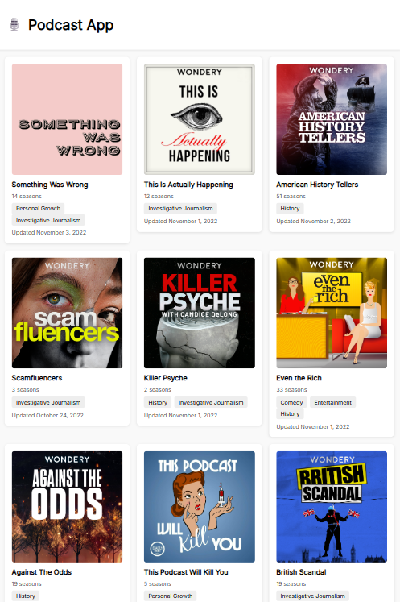
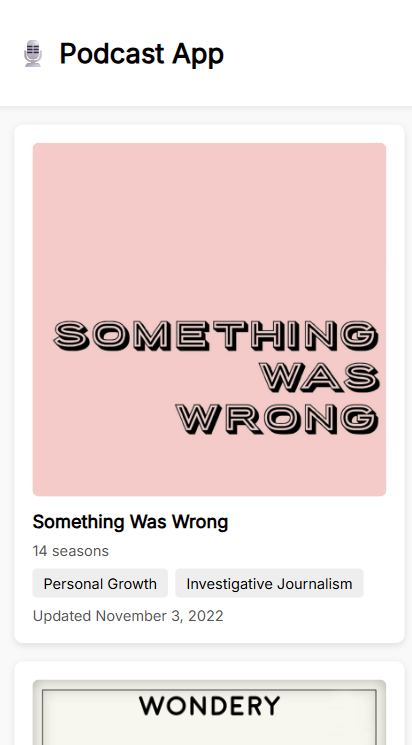

# 🎙️ Podcast Preview Web Component

A reusable **podcast preview card** built using **HTML, CSS, and JavaScript Web Components**.
Each podcast is displayed as a **custom HTML element** (`<podcast-card>`) that shows the podcast’s image, title, genres, number of seasons, and last updated date.

Clicking a card triggers a **custom event** that your application can listen for to open a modal or show detailed information.

## 🚀 Features
#### ✅ Reusable Web Component

- Custom element: `<podcast-card>`

- Encapsulated using Shadow DOM

- Safe, modular design with isolated styles and markup

- Can be used anywhere in the app without rewriting HTML

#### ✅ Data-Driven Rendering

- Accepts data through HTML attributes

- Automatically updates when attributes change

- Displays podcast cover, title, genres, seasons, and formatted date

#### ✅ Interaction Events

- Dispatches a custom event: `podcast-selected`

- Sends the podcast’s ID to the main app

- Supports bubbling & composed events to escape shadow DOM

#### ✅ Clean Structure

- Web Component (podcastCard)

- Grid Renderer (createGrid) for layout

- Modal component handles the detail view

#### 🛠️ Technologies Used

- HTML5 Custom Elements

- Shadow DOM

- Vanilla JavaScript Modules

- CSS3 (isolated styles inside components)

📁 Folder Structure
project-root/
├── index.html               # App entry point
├── styles.css               # Global styles
├── src/
│   ├── main.js             # Main app logic
│   ├── data.js              # Podcast data source
│   ├── components/
│   │   ├── podcastCard.js   # Web Component definition
│   │   ├── createModal.js   # Modal logic
│   │   └── createGrid.js    # Renders podcast-card elements
│   └── utils/
│       ├── GenreService.js  # Maps genre IDs to names
│       └── DateUtils.js     # Date formatting helper
└── README.md

#### 💡 How to Use the `<podcast-card>` Component
##### 1️⃣ Register the component
1. Import the component in your project:

```js
import "./components/podcastCard.js";
```

2. The component registers itself with:
```js
customElements.define("podcast-card", PodcastCard);
```
3. After this, you can use `<podcast-card>` as a custom HTML element anywhere in your app.


##### 🧩 Passing Data to the Component

The component receives podcast info through HTML attributes:

```html
<podcast-card
  podcastid="12"
  title="Design Talks"
  image="./covers/design.png"
  genres="1,3"
  seasons="4"
  updated="2024-02-12">
</podcast-card> 
```


#### 🎧 Listening for Interaction Events

When the user clicks a podcast card, the component dispatches:

`podcast-selected`

Example listener:

```js
document.addEventListener("podcast-selected", (event) => {
  console.log("User clicked podcast:", event.detail.id);
});
```

This is useful for opening the details modal:

```js
card.addEventListener("podcast-selected", (e) => {
  createModal.open(podcastObject);
});
```

#### 🧪 How to Run

- Download or clone the repository

- Open `index.html` in your browser

- The podcast grid will render from data.js

- Click any podcast card to trigger the modal

- Open DevTools → Console to see dispatched events

#### 📸 Screenshots
###### Example of desktop view


###### Example of mobile view


### 🧑‍💻 Author

Created by _Ayabonga Mtsotso_

---